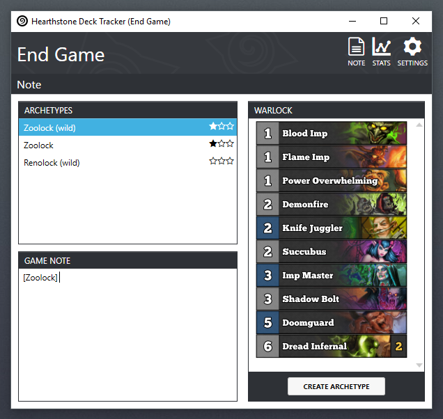
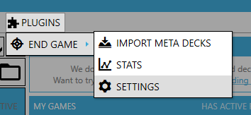
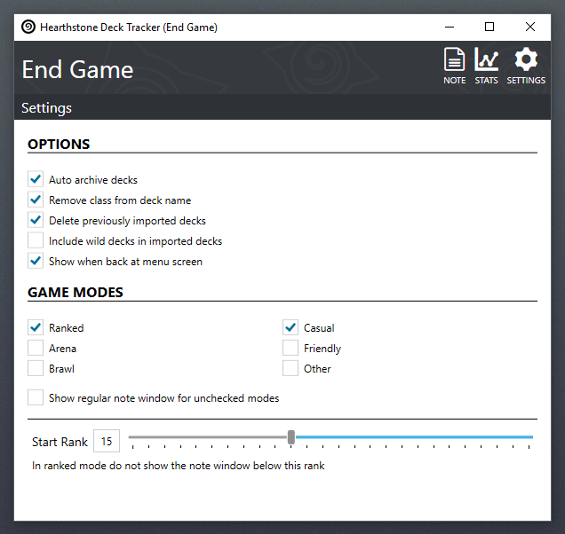
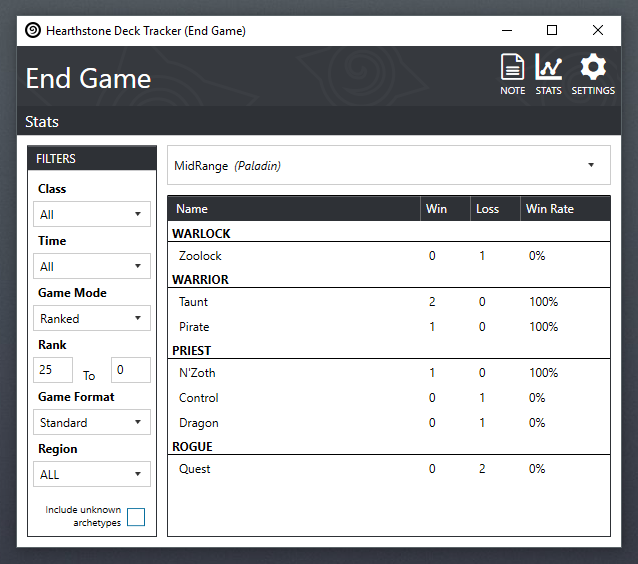

## End Game

A [Hearthstone Deck Tracker](https://hsdecktracker.net/) that helps keep track of your opponents deck types after a game.

---

## Install
- Download the [latest release](https://github.com/andburn/hdt-plugin-endgame/releases/latest) (*not the source code*)
- Unzip the contents into you Hearthstone Deck Tracker's plugins folder (or drag-and-drop onto the plugin menu)
- Enable the plugin in HDT's settings
- Use the plugin [settings](#settings) to customize it's behaviour

## Features
The plugin is designed to help players who like to keep track of their opponents deck types in HDT's game note field. It works by comparing your opponents deck against decks in HDT that have the tag *Archetype*. [TempoStorm's snapshot](https://tempostorm.com/hearthstone/meta-snapshot/) decks are used as the base archetypes and will update automatically, but you can add your own if you wish. Basic archetype matchup [stats](stats) are also provided.

## Usage
The plugin menu allows you to access the [settings](#settings) and [stats](#stats). It is also possible to update the snapshot decks manually, this should not be necessary though as they will update automatically.

### Settings
The settings page allows you to change how the plugin behaves.

- **Auto archive decks**, imported meta decks will be archived (recommended).
- **Remove class from deck name**, when importing decks change `Control Warrior` to just `Control`.
- **Delete previously imported decks**, when enabled, imported meta decks will delete any previous meta decks the plugin has imported (decks tagged with '*EndGame*') to avoid duplication (recommended).
- **Include wild decks in imported decks**, import the wild snapshot as well as the standard one.
- **Show when back at menu screen**, wait until you are back at the play menu before showing the note window.
- **Game Modes**, select the game modes that you want the archetype note to be displayed.
- **Show regular note window for unchecked modes**, show a regular note window without archetype info unchecked game modes.
- **Start Rank**, for ranked play set the rank at which you want the note window to start being displayed.

### Stats
The plugin also provides some basic win rate statistics based on the archetypes that have been assigned to games.

Select a deck from the drop down menu to see the stats for that deck.
The filters on the right allow you to pick the type of games you are interested in.

## License
The plugin is licensed under the terms of the MIT license. The full license text is available in the LICENSE file.

## Attribution
This plugin uses [IcoMoon](https://icomoon.io/) free font icons licensed under [CC BY 4.0](https://creativecommons.org/licenses/by/4.0/)
